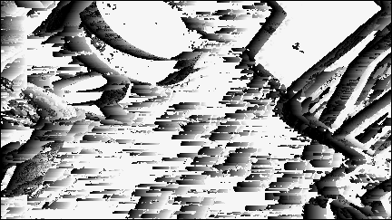
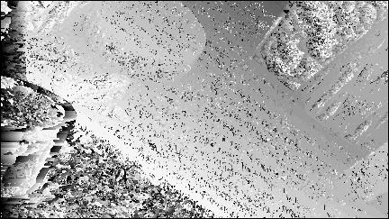
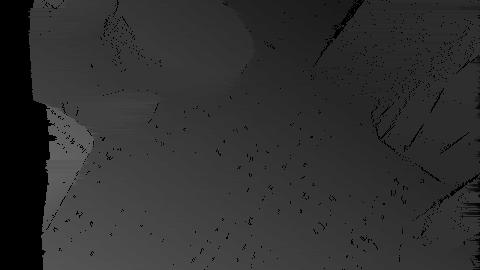

# Projective Transformation and Stereo Matching

## Stereo Matching

### Problem Statement
Use two rectified images as the inputs to estimate the depth map of the scene and compare the results quantitatively and qualitatively with ground truth depth map provided for a pair of input images.

### How to Use the Application 

1. Clone the repository to your machine using the following command:
`git clone "https://github.com/ojaashampiholi/Projective-Transformation-Stereo-Matching.git"`

2. Change the directory to access the files as follows:
`cd Projective-Transformation-Stereo-Matching/`

3. To test the application on the images use the following code:
`python code_filename.py left_image right_image gt_image`

For example: 
`python StereoMatching.py 1/0015_rgb_left.png 1/0015_rgb_right.png 1/0015_gt.png`
`python StereoViterbi.py 1/0015_rgb_left.png 1/0015_rgb_right.png 1/0015_gt.png`

### Algorithm
•	Input: Images from both left and right camera are taken as the input by the program along with the ground truth depth map. 

•	All the images are converted to grayscale, this step is done to increase the computational speed.

•	If input image size is found larger than certain threshold level, image resizing is done, which helps to boost computational speed.

•	Two types of scoring schemes have been used here to compute depth map, specifically, Sum of Squared Differences(SSD) and Cross Correlation(cor).

•	The sharpness and smoothness of depth map depends on Window Size and Maximum Offset Levels that can be tuned as per use case.

•	Output: The computed depth map is saved as output image.

•	Performance Metrics: The ground truth and computed depth map are used to compute the end point error and error rate. These measures show how well application performs on input image pairs for depth estimation.

### Improvement
To improve upon the current technique, a dynamic programming based algorithm, Viterbi Algorithm, has been implemented. It uses the values from it neighboring pixels to find the depth of current pixel. 

### Class Methods and Design Choices

#### resizeTemplate()
This method takes input image and resizing factor as input. The resizing factor must be a number between (0.25 - 1) where 0.25 implies that image is reduced to 1/4th of its original size and 1 implies no change in the image size. Resized image is given as output.

#### SSD()
This method takes left and right input images along with row, column, window size and offset information as input and computes the sum of squared differences between left and right input images which is returned as output. The formula for the same has been shown below:

#### cor()
This method takes left and right input images along with row, column, window size and offset information as input and computes the cross correlation between left and right input images which is returned as output. The formula for the same has been shown below:

#### getDepthMap()
This method takes left and right images as input along with window size, maximum offset, and type of scoring method to be used. If the scoring type is ‘ssd’, then sum of squared difference scoring is used. If the scoring type is ‘cc’, then cross correlation scoring is used. Offset factor is calculated as 255 / maxOffset. This is done to ensure that pixel values in depth map always lie between 0 and 255. 

For each pixel in the left image, all the pixels in the corresponding window along with offset are compared from the right image. The offset of pixel with the least score is chosen as the output offset level. This offset is multiplied by the offset factor to get the corresponding pixel value for the depth map from the calculated disparity. The depth map is returned as output by this method.

#### endPointError()
This function takes depth map and ground truth images as input and calculates the end point error between images which is returned as output. The implementation uses following formula:

#### errorRate()
This function takes depth map and ground truth images as input and calculates the error rate between images which is returned as output. The implementation uses following formula:

#### stereoMatch()
This method is the main method which implements all the steps mentioned in Algorithm using the above support functions.

### Results

Overall, the window based matching using SSD and cross correlation captured the depths of the images, but produced a noisy depth map, whereas viterbi algorithm produced a smoother depth map which looked much closer to the ground truth. The outputs for all the given images have been added to the repo. But here are some qualitative and quantitative resutls. 

#### Qualitative Results - 
1. Cross Correlation

2. SSD

3. Viterbi

#### Quantitative Results - 

Evident from the results, the algorithm do capture some depth information, but viterbi shows great improvement on the results. 

