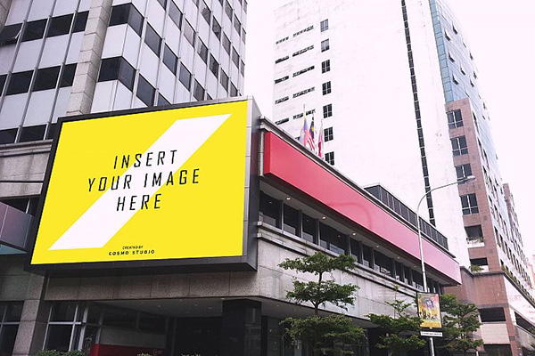
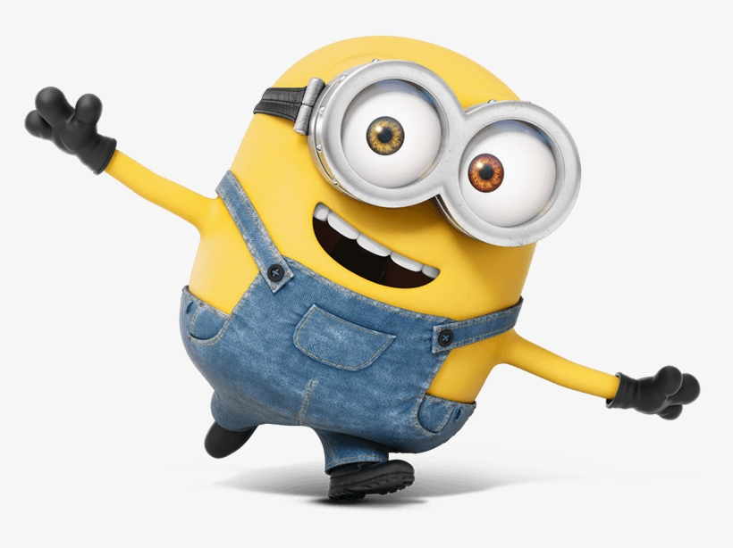
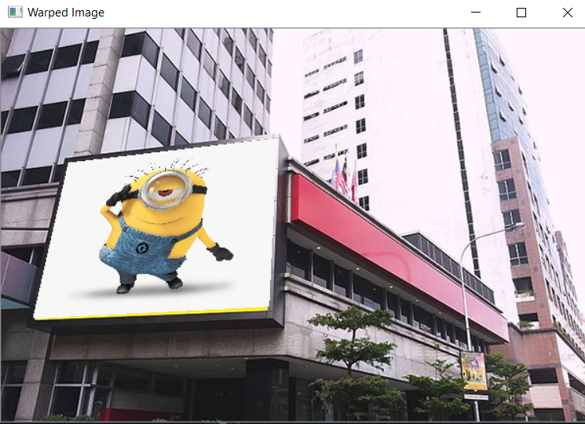
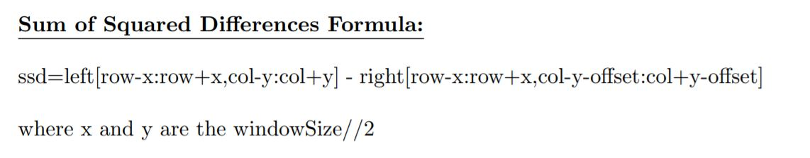
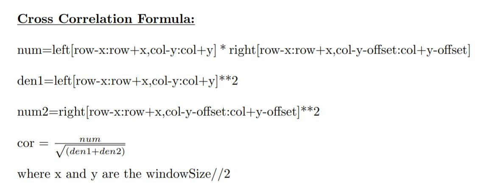
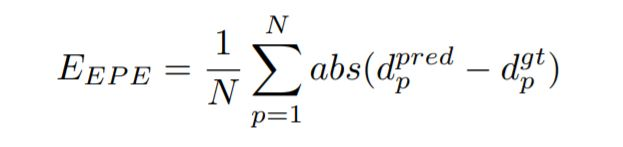
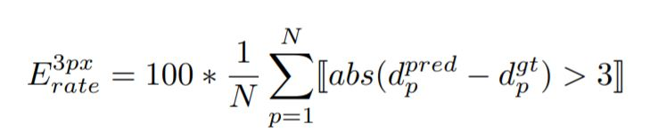

# Projective Transformation and Stereo Matching

## Putting Happy Minions Faces on Empty Billboards of Times Square

### Problem Statement:

Given a source image and an empty billboard image (target), the code should put the source image on the empty billboard of the Time Square automatically.

### How to Use the Application:

Clone the repository to your machine using the following command

`git clone "https://github.com/ojaashampiholi/Projective-Transformation-Stereo-Matching.git"`

Then change the directory to access the files as follows

`cd Projective-Transformation-Stereo-Matching/`

To test the application on command line, run using the below command followed by annotation of the target image.

`python homography.py source_image_name target_image_name`

### How to annotate:

Once the program runs, the source image is displayed on a window. Upon closing the source image window, the target image window appears. Annotate the four corners of the target image (by clicking on the desired points using mouse) and close the window. While annotating, make sure to start from the top left corner of the empty bill board and continue clockwise. Finally, the output window opens up with the warped source image on the bill board.

### Source code working explained:

1.The input source code and target images are read and displayed.

2.Four corners on the target image are annotated by mouse clicks received from the user. The annotated target image and the coordinates of the annotated corners are saved.

3.The source image corners are defined from starting at the top left corner marked as (0,0) and continuing clockwise. Second pair would be (width,0) on the top right corner, third pair would be (width,height) on the bottom right corner and (0,height) on the bottom left corner. It is important to maintain the order while annotating and defining the corner points in the source image as this preserves the one to one point correspondence between the two images in the right way.

4.Estimating Homography Matrix:

4a.Defining matrix A:
The homography matrix H is a 3*3 matrix with 9 unknowns. This matrix can be computed with a matrix system such that the four pairs of correspondance points are written as 2×9 matrices such as:

						 [[-xi, -yi, -1, 0, 0, 0, xi*ui, yi*ui, ui],
                         [0, 0, 0, -xi, -yi, -1, xi*vi, yi*vi, vi]]
   where (x,y) point pair belongs to the source image and (u,v) point pair belongs to target image. 
The above matrix form is achieved by the following steps:

Four 2*9 matrices are defined as above one for each pair of points. Thus, after stacking them together for multiple point correspondences, we get the matrix A of shape 8*9. Since there are 9 unknowns in the H matrix, we can appened a row of zeros with the last element one to the matrix A and make it 9*9.

4b.Least Square method: 
To solve the system of linear equations of the form Ah = 0, we have used Eigenvalues and Eigenvectors. We applied SVD on matrix A, and have taken the eigen vector corresponding to the minimum eigen value. This eigenvector of shape (9*1) when reshaped to 3*3 matrix gives the Homography matrix for our problem.

5.Applying Homography matrix to the source image:
For every pixel in the source image, we can compute the projected coordinates p^(x^,y^) of any point p(x,y) such as:

The homogeneous coordinates need to be converted to cartesian coordinates. Upon dividing the first two entries of p^ by the third coordinate, we can get the projected coordinates p^(x^,y^) in the cartesian form. The pixel values of the source image at p(x,y) are pasted on the target image at the corresponding projected coordinate p^(x^,y^). The resultant image will have the warped source image on the target image. 

### Methods explained:

#### read_image()
Reads the source and target images using the path provided while running the code

#### display_image()
Displays the source and target images

#### call_mouse_event()
Mouse event is triggered as and when a new point is clicked on the target image and the method annotate_image() gets called to mark the selected point on the image

#### form_Amatrix()
This method is where the source image corners are defined, matrix A of the above format is defined.

#### estimate_homography_matrix()
This method is where the SVD of matrix A is done, smallest eigen vector is found to estimate the homography matrix.

#### apply_homography()
Here, for every pixel in the source image, we calculate the projected coordinate and convert them from homogeneous form to cartesian form and paste the pixel value on the target image. 

### Results
The Empty Billboard Image is

The Minion Image is

The Output Image obtained from the program is

## Stereo Matching

### Problem Statement
Use two rectified images as the inputs, estimate depth map and compare the results quantitatively and qualitatively with ground truth image provided for pair of input images.

### How to Use the Application 

Clone the repository to your machine using the following command

`git clone "https://github.com/ojaashampiholi/Projective-Transformation-Stereo-Matching.git"`

Then change the directory to access the files as follows

`cd Projective-Transformation-Stereo-Matching/`

To test the application on command line, run using the below command

`python StereoMatching.py path_to_left_image path_to_right_image path_to_gt_image`

### Algorithm
•	Input Images from both left and right camera are taken as the input by this program along with the ground truth depth map. 

•	All the images are converted to grayscale, this step is done to increase the computational speed.

•	If input image size is found larger than certain threshold level, image resizing is done, which helps to boost computational speed.

•	Two types of scoring schemes have been used here to compute depth map (Sum of Squared Differences(SSD) and Cross Correlation(cor) ).

•	The sharpness and smoothness of depth map depends on Window Size and Maximum Offset Levels that can be tuned as per use case.

•	The computed depth map is saved as output image.

•	The ground truth and computed Depth Maps are used to compute the end point error and error rate. These measures show how well application performs on input image pairs for depth estimation.

### Class Methods and Design Choices

#### resizeTemplate()
This method takes input image and resizing factor as input. The resizing factor must be a number between (0.25 - 1) where 0.25 implies that image is reduced to 1/4th of its original size and 1 implies no change in the image size. Resized image is given as output.

#### SSD()
This method takes left and right input images along with row, column, window size and offset information as input and computes the sum of squared differences between left and right input images which is returned as output. The formula for the same has been shown below:

#### cor()
This method takes left and right input images along with row, column, window size and offset information as input and computes the cross correlation between left and right input images which is returned as output. The formula for the same has been shown below:

#### getDepthMap()
This method takes left and right images as input along with window size, maximum offset, and type of scoring method to be used. If the scoring type is ‘ssd’, then sum of squared difference scoring is used. If the scoring type is ‘cc’, then cross correlation scoring is used. Offset factor is calculated as 255 / maxOffset. This is done to ensure that pixel values in depth map always lie between 0 and 255. 

For each pixel in the left image, all the pixels in the corresponding window along with offset are compared from the right image. The offset of pixel with the least score is chosen as the output offset level. This offset is multiplied by the offset factor to get the corresponding pixel value for the depth map from the calculated disparity. The depth map is returned as output by this method.

#### endPointError()
This function takes depth map and ground truth images as input and calculates the end point error between images which is returned as output. The implementation uses following formula:

#### errorRate()
This function takes depth map and ground truth images as input and calculates the error rate between images which is returned as output. The implementation uses following formula:

#### stereoMatch()
This method is the main method which implements all the steps mentioned in Algorithm using the above support functions.

### Results
